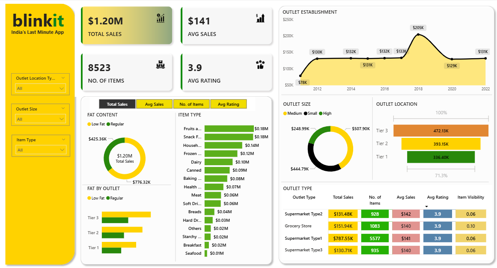

# 📊 Blinkit Sales Dashboard (Power BI)

This repository contains an interactive **Power BI dashboard** analyzing sales and operational performance for **Blinkit**, an instant delivery platform. The dashboard provides insights into sales, product categories, customer behavior, and performance metrics.

---
## 📸 Dashboard Preview
Here’s a snapshot of the dashboard:  

---

## 🚀 Project Overview
The **Blinkit Sales Dashboard** helps business stakeholders track:
- Total sales and revenue trends
- Sales performance by product categories
- Average order values and customer spending patterns
- Top-performing and low-performing products
- Geographic sales distribution

---

## 🛠️ Tools & Technologies
- **Power BI Desktop** – Data visualization and dashboarding
- **Excel/CSV (source dataset)** – Data cleaning and preparation
- **DAX** – For calculated measures and KPIs

---

## 📌 Key Insights
- Revenue distribution across product categories
- Monthly/weekly order volume and sales trends
- Customer purchasing patterns (frequency & average spend)
- Profitability of high-demand vs. low-demand items

